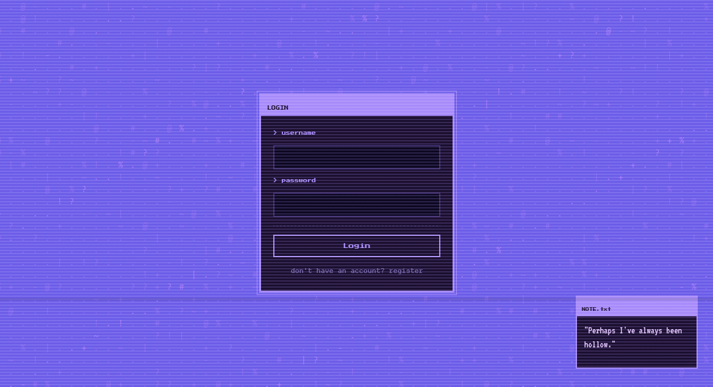
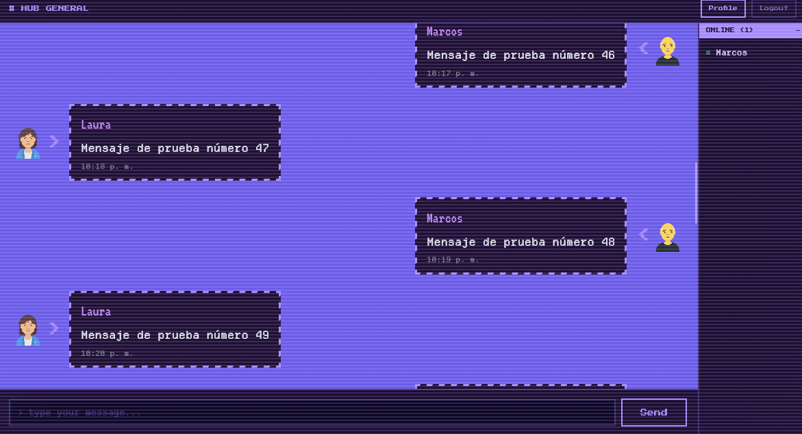
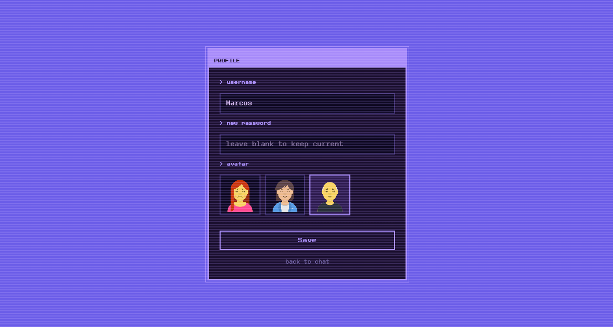
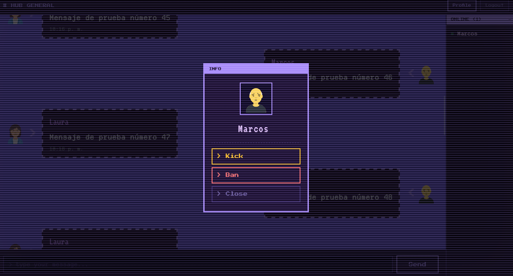

# Chat in Real Time

Real-time chat backend built with ASP.NET Core and SignalR. Started as a learning project and grew into something with a decent set of features.

[](https://dotnet.microsoft.com/)
[](https://www.postgresql.org/)
[](https://jwt.io/)
[](https://dotnet.microsoft.com/apps/aspnet/signalr)

---

## What it does

- Register and login with JWT authentication and BCrypt password hashing
- Real-time messaging via SignalR WebSockets
- Paginated message history — loads previous messages as you scroll up
- Typing indicator and online users list
- Join/leave notifications
- Role system: User, Moderator, Admin
- Admins can ban users — if they're connected, they get kicked instantly
- Moderators and Admins can delete messages — removed in real time for everyone
- Profile pictures from a set of shared avatars
- Profile updates (username, avatar) reflect immediately in the chat for all users

---

## Stack

- .NET 8.0 / ASP.NET Core
- SignalR
- PostgreSQL with Entity Framework Core 9
- JWT Bearer authentication
- BCrypt.Net for password hashing

The project follows Clean Architecture — Domain, Application, Infrastructure, and Presentation layers.

---
## Preview





## Getting started

### Requirements

- .NET 8.0 SDK
- PostgreSQL

### Configuration

Edit `appsettings.Development.json`:

```json
{
  "ConnectionStrings": {
    "DefaultConnection": "Host=localhost;Database=chat_db;Username=postgres;Password=yourpassword"
  },
  "Jwt": {
    "Key": "your-secret-key-minimum-32-characters-long",
    "Issuer": "chat-in-realtime",
    "Audience": "chat-in-realtime"
  }
}
```

### Run

```bash
cd Backend/src/chat-in-realtime
dotnet run
```

API runs at `http://localhost:5135`. Swagger available at `/swagger`.

> The database is dropped and re-seeded on every start — development only.

---

## API

### Auth

| Method | Endpoint | Description |
|--------|----------|-------------|
| POST | `/api/auth/register` | Register a new user |
| POST | `/api/auth/login` | Login and get JWT |

### Users

| Method | Endpoint | Access | Description |
|--------|----------|--------|-------------|
| GET | `/api/user/me` | Authenticated | Own profile |
| GET | `/api/user/profiles` | Authenticated | All users' username and picture |
| GET | `/api/user` | Admin | All users with full data |
| PATCH | `/api/user/me` | Authenticated | Update own profile |
| PATCH | `/api/user/{id}` | Admin | Update any user |
| POST | `/api/user/{id}/ban` | Admin | Ban a user |
| POST | `/api/user/{id}/unban` | Admin | Unban a user |
| POST | `/api/user/{id}/role` | Admin | Change role |

### Messages

| Method | Endpoint | Access | Description |
|--------|----------|--------|-------------|
| DELETE | `/api/message/{id}` | Admin, Moderator | Delete a message |

### Pictures

| Method | Endpoint | Description |
|--------|----------|-------------|
| GET | `/api/picture` | Get available avatars |

---

## SignalR Hub — `/chathub`

Authentication is handled via the JWT token passed to the connection. Banned users are rejected on connect.

### Client → Server

| Method | Description |
|--------|-------------|
| `SendMessage({ content })` | Send a message (rate limited: 1/sec) |
| `LoadMessages(page)` | Load message history (20 per page) |
| `StartTyping()` | Notify others you're typing |
| `StopTyping()` | Notify others you stopped |
| `KickUser(userId)` | Kick a user (Admin/Moderator only) |

### Server → Client

| Event | Emitted to | Description |
|-------|-----------|-------------|
| `ReceiveMessage` | All | New message |
| `LoadMessages` | Caller | Paginated history |
| `MessageDeleted` | All | A message was deleted |
| `UserConnected` | All | Someone joined |
| `UserDisconnected` | All | Someone left |
| `UpdateConnectedUsers` | All | Updated online list |
| `UserTyping` | Others | Someone is typing |
| `UserStoppedTyping` | Others | Someone stopped typing |
| `UserUpdated` | All | Profile was updated |
| `Kicked` | Target | You were kicked or banned |

---

## Roles

| Role | Permissions |
|------|-------------|
| User | Send messages |
| Moderator | Delete messages, kick users |
| Admin | Everything: ban, unban, kick, delete, change roles |

---

## Contributors

<table>
  <tr>
    <td align="center">
      <a href="https://github.com/Tomilomi">
        
        <br />
        <sub><b>Tomilomi</b></sub>
      </a>
    </td>
    <td align="center">
      <a href="https://github.com/Mudo0">
        
        <br />
        <sub><b>Mudo0</b></sub>
      </a>
    </td>
  </tr>
</table>
